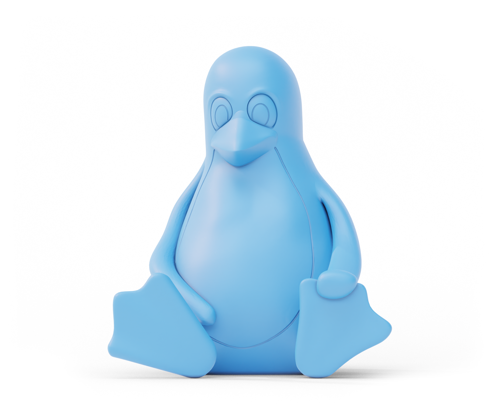

## **Welcome to Xander's neato portfolio.**

___

**On the internet, I am known mostly for stuff like this.**

Thermal Paste Tutorial | redd.it/5qqksq

Wiping a Hard Drive | redd.it/5rwlyi

**But have improved significantly over time.**

**Getting deeper into organic modeling.**

**Delving into stylized rendering and NPR.**

*And eventually succeeding at it.*

**Lastly, here's some product design.**

**And a 3D printable STL.**
 
 
 [Download Here.](https://github.com/Nautalis/Tux3D/blob/main/Tux_Penguin.stl)

